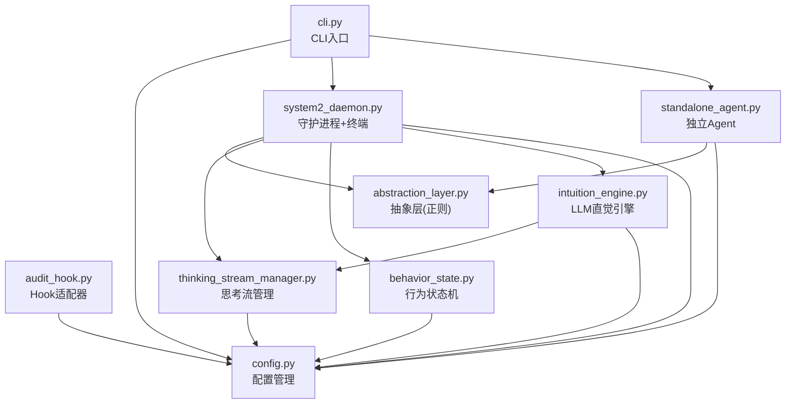
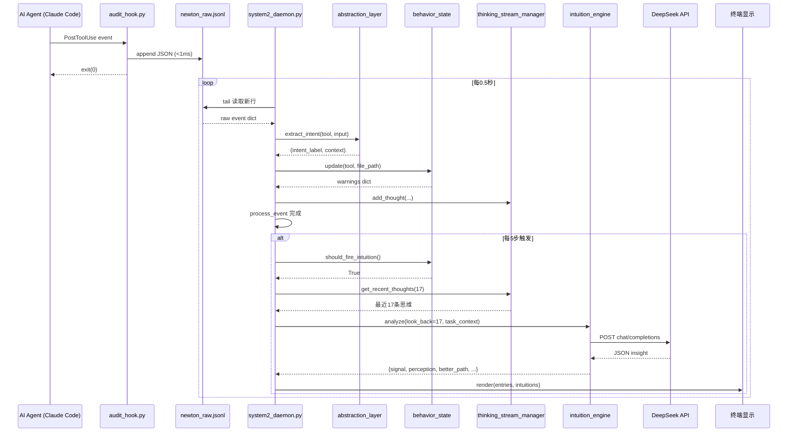

# Newton-X v2.0 架构评审报告

> 评审人：架构师高见远 (Gao)
> 评审日期：2026-06-30
> 评审范围：全量代码 (core/ 9模块 + tests/ 4测试 + reports/ 3样本)
> 依据：ATLAS.md + ENGINEERING_ASSESSMENT.md + 全部源码通读

---

## 一、架构评估 (3强项 + 3风险/缺口)

### 强项

**S1: 认知流水线分层干净，零循环依赖。**
数据流 `raw events → abstraction → thinking → behavior → intuition → display` 是严格单向的。每个模块职责单一、边界清晰。`abstraction_layer.py` 尤为出色——纯函数、静态方法、零副作用、正则集中管理。这是全项目最干净的模块，体现了正确的分层思维。

**S2: Prompt驱动检测而非规则引擎。**
SYSTEM_PROMPT 不定义"正确/错误模式清单"，而是定义四轮思考空间 (Round 0 意图显化 → Round 1 发散直觉 → Round 2 自我质疑 → Round 3 收敛判断)。这个设计决策是架构级正确的——监控对象 (AI Agent 行为) 本身在快速进化，硬编码规则是刻舟求剑。Round 2 的自我质疑机制尤为精妙：它要求 LLM 先反驳自己的直觉，只保留经得起自我反驳的发现，防止引擎变成"告警主义者"。

**S3: Hook 极简 + 异步处理的分离正确。**
`audit_hook.py` 只做一件事——把原始事件写进 JSONL (<1ms)——然后立即退出。所有处理在 daemon 侧异步完成。这个分离使得 hook 不会阻塞用户工具调用，且 hook 侧静默吞错 (`except: pass # Never block the tool`) 是**正确的设计决策**——hook 绝不能因为自己的错误阻塞用户的生产工具链。

### 风险/缺口

**G1: daemon 仍有未修复的构造缺陷，系统从未真正端到端跑通。**
ENGINEERING_ASSESSMENT.md 标记了 3 个已修复的致命 bug (`entries` 先用后定义、`fire_intuition` 签名不匹配、`better_path` 字段错配)，但通读当前代码后发现仍存在：

| Bug | 位置 | 症状 |
|-----|------|------|
| `raw_fh` 从未打开 | `system2_daemon.py:232` | `NameError: name 'raw_fh' is not defined`，daemon 进入主循环即崩溃 |
| `current_task` 初始化后永不赋值 | `system2_daemon.py:206,249` | `fire_intuition(current_task)` 永远传 `None`，Round 0 意图显化在 daemon 路径永远死透 |
| `last_render` 赋值后永不读取 | `system2_daemon.py:276` | 死代码，设计意图可能是帧率节流但未实现 |

第一个 bug 意味着 daemon **当前无法启动**（除非绕过 CLI 直接裸调 engine，这正是所有测试做的事）。第二个 bug 意味着即便 daemon 启动了，README 重点宣传的"Round 0 意图显化"也永远不会生效。

**G2: 静默吞错让所有异常隐形。**
`system2_daemon.py` 存在 `:220/:270/:284` 三处 `except: pass`（注意：`raw_fh` 在 try 块外，所以 NameError 甚至不被这些 except 覆盖）。`audit_stream.jsonl` 写入了但没有消费方。全项目用 `print` + ANSI 终端渲染，无结构化日志、无错误计数、无健康检查端点。daemon 出任何问题，用户看到的只是一个"似乎还在刷新但内容不变"的终端——这会制造系统在正常工作的错觉。G1 的 bug 之所以能长期隐形，根因就是 G2。

**G3: 配置契约不诚实。**
`config.py` 定义了 `api_url`、`intuition_interval` 等字段且支持 file > env > default 三级优先级，但：
- `intuition_engine.py:165` 把 `API_URL` 硬编码为字面量，`_cfg()` 虽然读了 config 但 URL 已在模块级常量中固化
- `behavior_state.py:182` 的 `INTUITION_INTERVAL` 在模块加载时求值一次 (`_get_interval()`)，但 `intuition_engine.py:18` 也用同名 `_cfg` 读了 config——同一个值有两条读取路径，行为取决于 import 顺序
- cooldown 子系统 (`COOLDOWN_SECONDS=0`) 整个是死代码——`_in_cooldown()` 永远返回 `False`

用户改 `config.json` 中的这些值不会生效，但系统不报错——这是一种隐式契约违背。

---

## 二、模块分解评估

### 当前模块清单

```
core/
├── cli.py                    # CLI入口，命令分发
├── config.py                 # 配置管理 (file > env > default)
├── intuition_engine.py       # LLM 直觉引擎 (SYSTEM_PROMPT + API + 解析)
├── abstraction_layer.py      # 正则意图提取，零 LLM 成本
├── thinking_stream_manager.py # 思考流持久化 + 统计
├── behavior_state.py         # 跨调用计数器 + 触发逻辑
├── system2_daemon.py         # 常驻守护进程 + 实时终端渲染
├── audit_hook.py             # Hook 适配器，极简写入
└── standalone_agent.py       # 独立 Agent (独立产品，写入同一流)
```

### 结论：分解基本正确，建议一处微拆分

**不应动的模块 (6/9):**

- `abstraction_layer.py` — 完美。纯函数、零副作用、正则集中。全项目最干净的模块。
- `config.py` — 正确。三级优先级加载 + JSON 容错。不要改结构，只修 G3 的接线问题。
- `audit_hook.py` — 正确。极简、快速、不阻塞。不要动。
- `thinking_stream_manager.py` — 正确。持久化 + 查询 + 统计 + MAX_ENTRIES 上限。职责单一。
- `cli.py` — 正确。一个命令一个函数，清晰调度。有一个已知问题（路径含空格会断），是接线问题不是结构问题。
- `standalone_agent.py` — 独立产品，不属于监控核心，但写入同一流的设计是对的。

**不应合并的模块:**

- `behavior_state` 和 `abstraction_layer` 职责完全不同：前者是时序状态机（有状态、跨调用计数），后者是无状态纯提取。合并反而破坏纯度。
- `intuition_engine` 和 `thinking_stream_manager` 职责不同：前者是 LLM 调用 + prompt，后者是持久化 + 统计。合并会造出 god 模块。

**建议拆分的模块 (1/9):**

`system2_daemon.py` 当前承担四件正交的事：
1. 文件 I/O (tail JSONL, 写 audit stream)
2. 流水线编排 (abstraction → behavior → thinking → intuition)
3. 终端渲染 (ANSI 转义码 + Rich 风格的卡片式显示)
4. 进程管理 (PID file)

建议将**终端渲染**提取为 `display.py`。理由：
- 渲染逻辑 (~70 行，`render()` 函数 + 颜色常量) 与事件处理逻辑正交
- 分离后可单独测试（给 render 喂假数据 → 断言输出格式）
- 未来如果要换输出方式（Web dashboard、JSON 格式、文件导出），只需要换 display 实现

不拆分也**可以接受**——当前 daemon 约 290 行，在 1100 行总量项目中不算膨胀。这是一个"做也行、不做也行"的建议。

---

## 三、数据流在不同部署场景下的评估

### 当前数据流

```
Agent 工具调用
  │
  ├─→ [Hook模式] audit_hook.py ──→ newton_raw.jsonl (文件)
  │
  ├─→ [直接模式] Agent 直接写 ──→ newton_raw.jsonl (文件)
  │
  ▼
system2_daemon.py
  ├─ tail 文件读取新行
  ├─ abstraction_layer → intent 标签
  ├─ behavior_state → 计数器 + 简单告警
  ├─ thinking_stream_manager → 持久化到 JSON
  ├─ intuition_engine → 每5步 LLM 直觉
  └─ 终端 ANSI 渲染
```

### 单机部署 (当前设计)

**评估：数据流设计正确。** 文件作为通信媒介在单机场景下是合理的——零网络依赖、零额外进程、天然持久化、crash 后可恢复。tail 式读取是简单的增量消费者模式。

**但有一个设计问题**：daemon 通过 `raw_fh.tell()` / `raw_fh.readline()` / `raw_fh.seek()` 做类 tail 循环，这在以下场景会出问题：
- 文件被外部 truncate 时，`tell()` 位置失效
- 文件轮转 (logrotate) 时，daemon 还指着旧 inode
- Windows 上 `seek()` 行为与 Unix 不完全一致

**建议**：短期内修复 `raw_fh` 未打开的 bug 即可。中期可考虑用 `watchdog` 库或简单的文件 stat + size 追踪替代手动 seek。

### 分布式部署 (多台机器上的 Agent 被一个中心 daemon 监控)

**评估：当前设计不支持，但流水线核心可复用。** 文件作为通信媒介天然是单机的。要支持分布式：
- 将 `newton_raw.jsonl` 替换为消息队列 (Redis Streams / Kafka / NATS)
- daemon 的 `process_event()` 核心逻辑 (133-170行) 无需改动——它是无状态的纯函数
- 需要改动的是文件 I/O 层（约 20 行）和 PID 管理

**改造代价：低。** 因为 `process_event()` 接收 `dict` 不关心来源，只需把 `while raw_fh.readline()` 换成 `while queue.pop()`。

### 云端部署 (daemon 跑在服务器，用户通过 Web 看监控)

**评估：当前设计不支持，但核心流水线无平台耦合。** 需要改动的是输出层：
- `render()` 函数当前直接写 stdout + ANSI 转义码
- 改造为 Web 模式需要：(a) 将 daemon 事件推送到 WebSocket；(b) 前端用 React/Vue 渲染卡片
- `intuition_engine` 的 LLM 调用、`abstraction_layer` 的提取、`behavior_state` 的计数均无需改动

**改造代价：中等。** 核心逻辑零改动，需要新增 WebSocket 推送层和前端。当前 render 与逻辑耦合在 daemon 中，分离 display 模块（见第二节建议）会显著降低此成本。

### 总结

| 场景 | 数据接入层 | 处理流水线 | 输出层 | 改造代价 |
|------|-----------|-----------|--------|---------|
| 单机 (当前) | 文件 I/O (有 bug) | 正确 | 终端 ANSI | 修 bug 即可 |
| 分布式 | 需替换为消息队列 | 零改动 | 不变 | 低 (~20行) |
| 云端 | 可复用文件/队列 | 零改动 | 需替换为 Web | 中 (需新增 Web 层) |

**架构核心判断：数据流设计是好的——接入层和输出层是薄壳，核心流水线无平台耦合。这是正确的分层。**

---

## 四、可扩展性评估

### 场景 A: 新增检测维度

假设要增加"过早优化检测"——Agent 在功能未完成时就做性能优化。

**难度：极易。** 工作量如下：
1. 修改 `SYSTEM_PROMPT` 的 Round 1，增加一条发散方向："Agent 是否在功能跑通前就开始做性能/架构优化？"
2. Prompt 输出格式不变——仍用 `signal/perception/amplification/regulation/better_path` 五字段
3. 代码零改动

这是 prompt 驱动架构的核心优势——检测维度的扩展是 prompt engineering，不是软件工程。

**如果新维度需要新的输入数据**（比如"每步耗时"），则需要：
1. `audit_hook.py` 在事件中加 `duration_ms` 字段 (hook 已有 `time.strftime`，加一个 `time.time()` 差值即可)
2. `_format_stream()` 在思维流展示中加时间信息
3. SYSTEM_PROMPT 中说明如何使用这个新字段

这仍然是轻量改动。

### 场景 B: 新增 LLM Provider

假设要从 DeepSeek 切换到 (或同时支持) OpenAI / Anthropic / 本地模型。

**难度：中等，有架构债需要先清理。** 当前障碍：

| 问题 | 位置 | 影响 |
|------|------|------|
| API 调用用 `subprocess` 调 `curl` | `intuition_engine.py:162-169` | 换 provider 需要改 shell 命令，脆弱 |
| API URL 硬编码在模块级常量 | `intuition_engine.py:18` | 虽然调了 `_cfg()`，但加载时机导致 config 可能未生效 |
| Authorization header 格式硬编码为 `Bearer` | `intuition_engine.py:167` | 换 API key 方式需要改代码 |
| `standalone_agent.py` 有独立的 curl 调用逻辑 | `standalone_agent.py:280-288` | 同样的逻辑写了两次 |

**推荐改造路径**：
1. 将 curl 调用替换为 `httpx` 或 `requests` 库 (消除隐式 curl 依赖)
2. 提取 `LLMProvider` 抽象：`def chat(system: str, user: str) -> dict`
3. 实现 `DeepSeekProvider`、`OpenAIProvider` 等子类
4. 在 config.json 中通过 `provider` 字段选择

改造量：约 100-150 行新代码 + 删除约 40 行旧 curl 代码。代价可控。

### 场景 C: 新增被监控工具类型

假设 Claude Code 新增了一个 `Task` 工具类型。

**难度：极易。** 需要改动：
1. `abstraction_layer.py:63-78` 的 `extract_intent()` 加一个 `elif` 分支
2. `thinking_stream_manager.py:27-38` 的 `ICONS` 加一个图标映射
3. `intuition_engine.py:214-216` 的 `_format_stream()` 加图标映射

三处都是加一行。abstraction_layer 的正则抽取可复用 `_extract_search_intent` 或写新的专用方法。

---

## 五、具体建议 (按影响力排序)

### R1 [致命] 修复 daemon 剩余构造缺陷，让系统真正跑通

**做什么**：
- (a) `system2_daemon.py` 主循环前补上 `raw_fh = open(RAW_STREAM, "r", encoding="utf-8")` ——当前 `raw_fh` 未定义，daemon 启动即崩
- (b) 让 `current_task` 可以被赋值——要么从 task_file 读取，要么提供 CLI 参数传入。当前 `None` 恒成立，Round 0 在 daemon 路径死透
- (c) 确认 `fire_intuition` 签名、`better_path` 字段名、`entries` 定义顺序三项已修复（代码中似乎已修，需回归验证）

**工时**：2-3h
**不做的代价**：系统不存在可用入口。所有"成功"报告来自绕过 daemon 的测试。这是架构评审转化为工程行动的前提条件。

### R2 [致命] 编写端到端冒烟测试，覆盖生产路径

**做什么**：写几行 raw 事件到 `RAW_STREAM` → 启动 daemon → 处理事件 → 断言：audit_stream 有输出、intuition 真触发、`better_path` 真出现。不走 engine 的直调路径。

**为什么**：当前 4 个测试全部绕过 daemon 直调 engine。这种测试无法发现 R1 的任何 bug。R1 修好后，没有 R2 锁住，bug 会再次悄悄回归。

**工时**：3-4h
**不做的代价**：R1 白修。

### R3 [高] 收口静默吞错，建立最小可观测性

**做什么**：
- daemon `:220/:270/:284` 三处 `except: pass` 至少打印到 stderr
- 裸 `except:` 改为具体异常类型 (`except (OSError, json.JSONDecodeError)`)
- 保留 `audit_hook.py:48` 的静默 (那处是对的——hook 不能阻塞用户工具)

**工时**：1-2h

### R4 [中] 接线或删除假装可配的配置项

**做什么**：`api_url`/`intuition_interval`/cooldown 三选一：(a) 让代码真读 config 的值，(b) 从 config.py 的 DEFAULTS 中删除这些字段。不要保持"看起来可配但实际不生效"的状态。

**工时**：1h

### R5 [中] 提取 display.py，解耦渲染与逻辑

**做什么**：将 daemon 中的 `render()` 函数 + 颜色常量 + 图标常量移到独立的 `core/display.py`。`system2_daemon.py` 只管事件循环和流水线编排。

**收益**：可单独测试渲染输出；未来换 Web dashboard 只需替换 display 实现。

**工时**：1-2h

### R6 [低] 用 httpx 替换 curl subprocess

**做什么**：将 `intuition_engine.py` 和 `standalone_agent.py` 中的 curl 调用统一替换为 `httpx` 库。消除隐式 curl 系统依赖，让错误处理更干净。

**工时**：2-3h

### R7 [低] 提取 LLMProvider 抽象

**做什么**：创建 `core/llm_provider.py`，定义 `LLMProvider` 抽象基类，实现 `DeepSeekProvider`。为未来多 provider 支持打底。

**注意**：对于当前单 provider 场景，这个抽象可能是过度设计 (YAGNI)。建议在真正需要第二个 provider 时再做。

### R8 [低] 文件源抽象化，支撑分布式部署

**做什么**：定义 `EventSource` 接口 (`def poll() -> list[dict]`)，实现 `FileEventSource` (当前行为)。未来可加 `RedisEventSource`、`HTTPEventSource`。

**注意**：同 R7，单机场景属于适度过度设计。但接口定义成本极低（一个抽象类），值得做。

---

## 六、一句裁决

**架构是对的——认知流水线分层干净、prompt 驱动而非规则引擎、hook 异步分离——但 daemon 里残存的接线断裂让这辆设计精良的车从未真正上路；小手术级修复 (R1+R2+R3) 可以让它在 1-2 天内真正跑起来，而模块分解和可扩展性底子足以支撑未来 3 个版本迭代不重写。**

---

## 附录

### A. 依赖包评估 (requirements.txt 级别)

```text
# 当前
rich>=13.0.0

# 建议
rich>=13.0.0
httpx>=0.27.0        # 替换 curl subprocess，消除隐式系统依赖
watchdog>=4.0.0      # (可选) 替换手动文件 tail，处理 truncate/轮转
```

`rich` 的实际使用情况需要核实——daemon 当前用原生 ANSI 转义码 (`\033[...`)，如果 rich 未被使用，应该从依赖中移除或改为实际使用 rich 的 Panel/Layout 组件。

### B. 错误处理约定 (共享约定建议)

```python
# 按场景分三级：
# 1. Hook 路径：静默吞错（正确，不阻塞用户工具）
#    except Exception:
#        pass  # Never block the tool

# 2. Daemon 事件处理：记录 + 继续
#    except Exception as e:
#        print(f"[Daemon] event error: {e}", file=sys.stderr)

# 3. Daemon 致命错误：记录 + 退出
#    except (OSError, KeyboardInterrupt) as e:
#        print(f"[Daemon] fatal: {e}", file=sys.stderr)
#        sys.exit(1)
```

### C. 待明确事项

1. **`rich` 库是否实际使用？** daemon 用原生 ANSI，如果 rich 未用可以从依赖中移除。
2. **`standalone_agent.py` 的定位** ——它是 Newton-X 产品的一部分，还是一个独立的演示工具？它的存在让 `core/` 边界变得模糊（它依赖 core 模块但也独立可运行）。
3. **`reports/` 目录的报告是过时快照吗？** ENGINEERING_ASSESSMENT 提到报告字段与当前 prompt 输出契约对不上。如果过时，建议标注 `reports/*.txt` 为 `# 历史快照 — 可能不与当前代码对齐`。
4. **Windows 路径空格问题** — `cli.py:31` 的路径拼接在含空格的目录下必断。需要修复引号包裹或改用 `subprocess.run` 传 list。
5. **intuition_interval 的加载时机** — `behavior_state.py:182` 在模块加载时求值，而 `intuition_engine.py:18` 也用同名函数读了 config。同一个值有两个读取路径，未来改动容易不一致。建议统一走 `config.get("intuition_interval", 5)`。

### D. 依赖关系图



### E. 主数据流时序图


